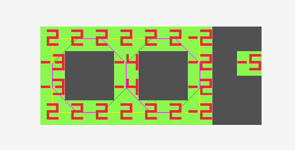
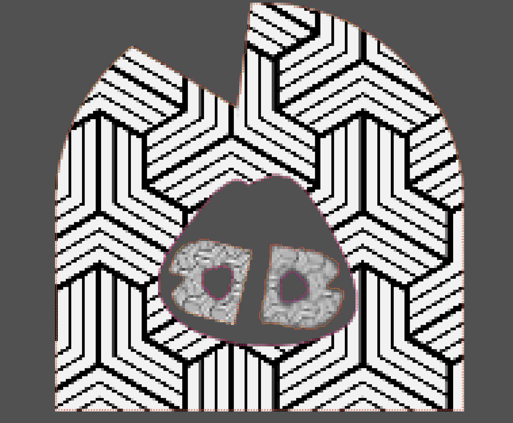

# Suzuki Abe Border Topology

This library implements an image border finding algorith from the paper **Topological Structural Analysis of Digitized Binary Images by Border Following**
by
- **SATOSHI SUZUKI** of Graduate School of Electronic Science and Technology, Shizuoka University, Hamamatsu 432, Japan
- **KEIICHI ABE** of Department of Computer Science, Shizuoka University, Hamamatsu 432, Japan 

The paper can be found at https://www2.ipcku.kansai-u.ac.jp/~yasumuro/M_InfoMedia/paper/Suzuki85.pdf

## Usage
```c
#include "sa_border_topology/sa_border_topology.h"

// load an image to analyze
Image image = ...;

// convert it to a "topology_image" such that:
// - each pixel is either 0 or 1 (i.e. 0 - transparent, 1 - opaque)
// - border pixels are all 0 (this could require you to expand the analyzed image by 2 pixels in each dimension)
int* topology_image = ...;

// analyze topology
SA_BorderTopology border_topology;
SA_allocate_topology(&border_topology, 10, 1000);
int result = SA_extract_topology(topology_image, image.width+2, image.height+2, &border_topology);

// do something with the topology data
...

// free
SA_free_topology(&border_topology);
```
Take a look at [examples/raylib/main.c](/examples/raylib/main.c) for usage implementation. The example app uses image alpha channel to produce topology information.

## Example
When the project is generated with SA_BUILD_EXAMPLES option there is an example executable target that produces the following results:



